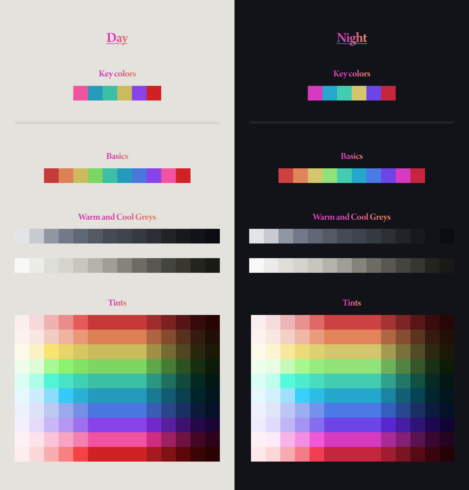

# Enchanted
Enchanted a sense of place.

The key colors are
Pink, marine, mint, yellow, purple, and rose

with the rest of the colors defined here including cool and warm greys:

It's not a fully comprehensive color system but it's enough for a lot of cases, starting off with [note-taking](https://github.com/enchantedcoloring/obsidian).
